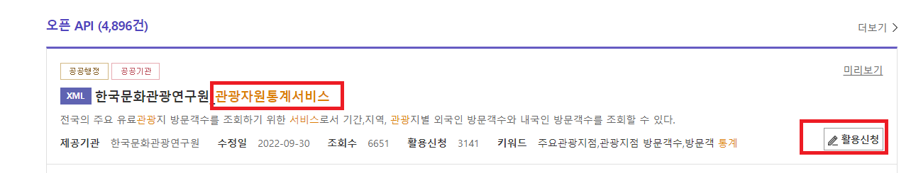
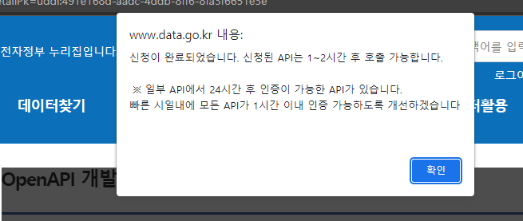
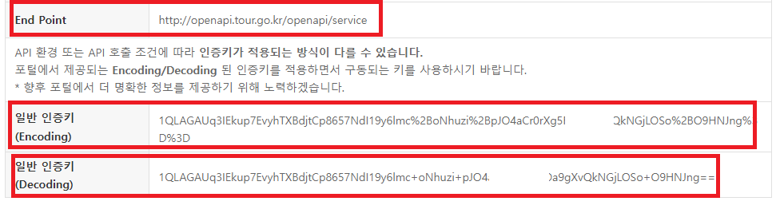
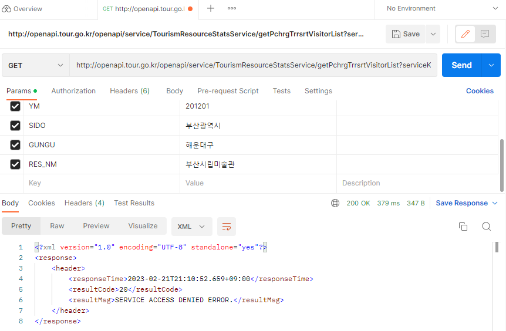
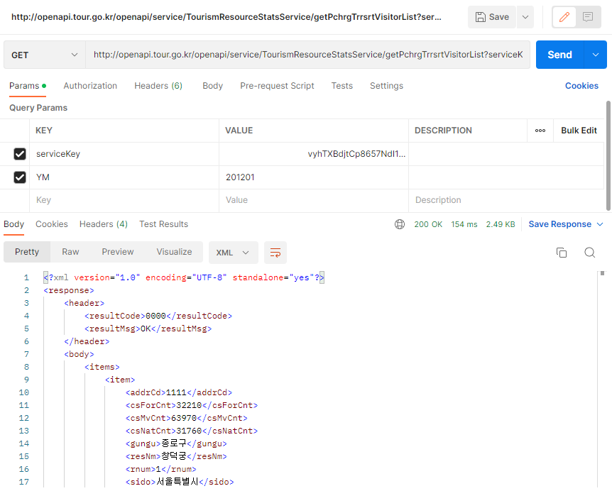
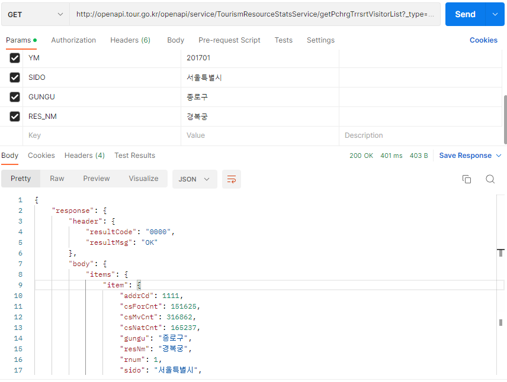

# 공공 데이터 수집


## 전국 유료 관광지 방문객 정보 현황 데이터 수집 (OpenAPI 이용)

- [공공 데이터 포털](https://www.data.go.kr) 로 들어간다.


- 검색 메뉴를 통해 `관광자원통계서비스`를 검색한다.


- Application 등록을 하여 API 이용신청을 한다.



- API 신청 후 어느 정도의 시간이 경과 후 승인될 수 있다.




- End Point, 인증키 정보 확인



- API 가 정상 동작하는지를 Postman으로 확인한다.
    * 승인 되지 않았을때의 모습



    * 승인 되었을때의 모습



- URI로 API 테스트

```
URI - http://openapi.tour.go.kr/openapi/service/TourismResourceStatsService/getPchrgTrrsrtVisitorList?
_type: json
serviceKey:  각자의 서비스키
YM: 201612
SIDO: 서울특별시
GUNGU: 종로구
RES_NM: 경복궁
```




- 테스트된 API로 반환된 JSON 분석을 위해서 [json parser](http://json.parser.online.fr/)라는 사이트를 이용할 수 있다.


- API 테스트를 기반으로 코드 작성


```
import os
import sys
import urllib.request
import json    
import pandas as pd

serviceKey = '1QLAGAUq3IEkup7EvyhTXBdjtCp8657NdI19y6lmc%2BoNhuzi%2BpJO4aCr0rXg5FfOa9gXvQkNGjLOSo%2BO9HNJng%3D%3D'
end_point ='http://openapi.tour.go.kr/openapi/service/TourismResourceStatsService/getPchrgTrrsrtVisitorList?_type=json&'


def make_url(ym,sido,gungu,res_nm):
    url = end_point+'serviceKey='+serviceKey+'&YM='+ym+'&SIDO='+sido+'&GUNGU'+gungu+'&RES_NM='+res_nm
    return url
    
# url = make_url(urllib.parse.quote("201612"),urllib.parse.quote("서울특별시"),urllib.parse.quote('종로구'),urllib.parse.quote('경복궁'))


def make_request(url):

    request = urllib.request.Request(url) 
    response = urllib.request.urlopen(request)    
    rescode = response.getcode()


    if(rescode==200):
        response_body = response.read()
        # print(response_body.decode('utf-8'))
        result = json.loads(response_body)   # json 라이브러리를 활용한 파이썬 Dictionary로 변경
        # for i in result['items']:
        #     print(i['postdate'],i['title'],i['description'],i['link'])
    
        return result
    else:
        print("Error Code:" + rescode)
        return None
    


######## yyyymm 형식의 기간 설정 ########
 

# yyyymm 형식을 월 단위로 변경하기
    
def to_month(yyyymm):
    y, m = int(yyyymm[:4]), int(yyyymm[4:])
    return y * 12 + m                                

def iter_months(start, end):
    for month in range(to_month(start), to_month(end) + 1):
        y, m = divmod(month-1, 12)  # 12월의 경우 나머지가 0으로 떨어지기에 이를 보정해 주기위해 month -1 로 나눠준 계산. 값을 반환할때 다시 month + 1로 보정
        yield y, m + 1              # 반복문을 돌때 마다 결과값을 제공

def call_tourist(start, end):
    results = []   
    for y, m in iter_months(start, end):
        yyyymm = str(y)+str(m).zfill(2)      # API 호출 형식에 맞게 yyyymm 형식으로 변경
        url = make_url(yyyymm,urllib.parse.quote("서울특별시"),urllib.parse.quote('종로구'),urllib.parse.quote('경복궁'))  
        result = make_request(url)     # API 호출
        # print(result)
        results.append(result['response']['body']['items']['item'])    # 딕셔너리를 리스트로 추가
        
    df = pd.DataFrame.from_records(results, index='ym')
    
    return df

response_df = call_tourist('201801','201812')
response_df.to_csv("tourist.csv", index=True, encoding="utf-8-sig")
```